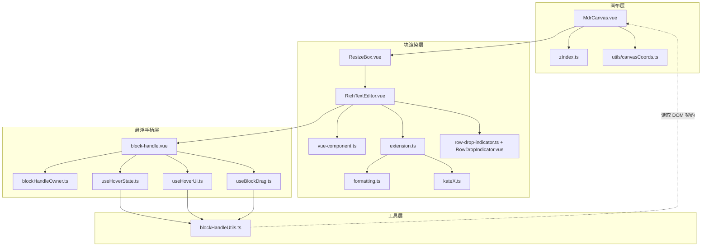
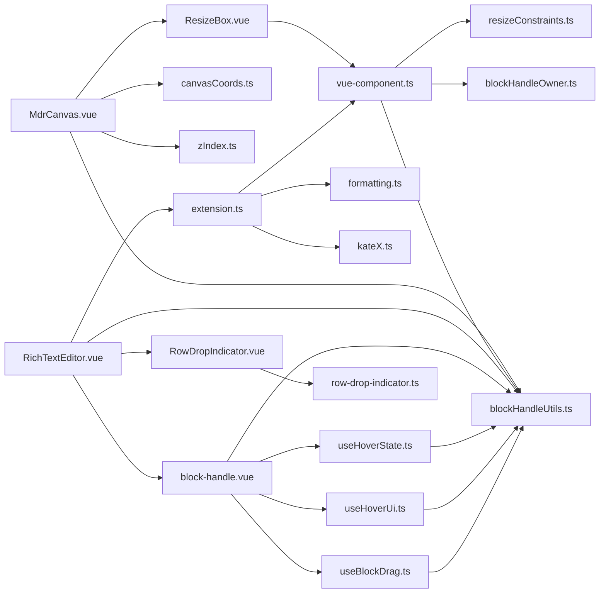

<!-- 最后验证: 2026-10-4 -->
# 00 系统全景

## 心智模型

1. **MdrCanvas.vue 是唯一状态源**：块布局、选中、链接、缩放都在这里。
2. **跨组件通信靠两套契约**：`Mindrizzle:*` CustomEvent + DOM 选择器（详见 02-contracts）。
3. **坐标系是最大认知负担**：画布侧 content/screen/visual 三态，编辑器侧 layout/viewport 两态。

## 图 0.1 系统全景

## 图 0.2 import 依赖图

## 层职责

- **画布层**：MdrCanvas 管布局/会话/缩放；zIndex 定层；canvasCoords 管换算。
- **块渲染层**：ResizeBox 提供拖拽/缩放手柄；RichTextEditor 承载 ProseMirror；vue-component 是 PM 节点视图。
- **悬浮手柄层**：block-handle + 三个 hook，负责 hover / popup / 行拖拽。
- **工具层**：blockHandleUtils 是编辑器侧唯一坐标与几何入口。

## 维护提示

- 新增文件 → 更新图 0.1、0.2
- 新增跨层依赖 → 检查是否应该走事件而不是 import