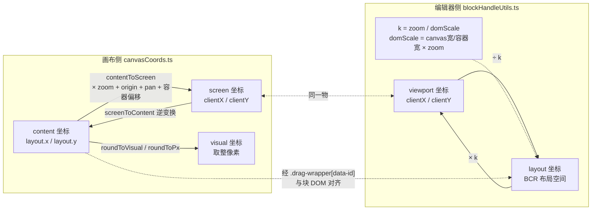
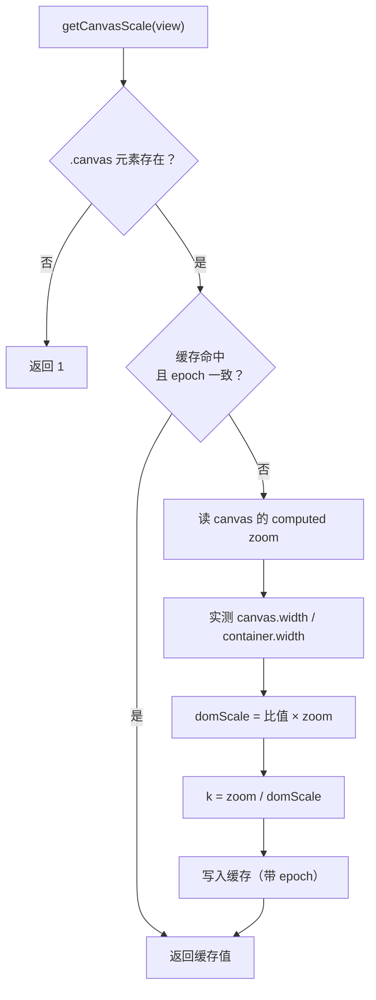
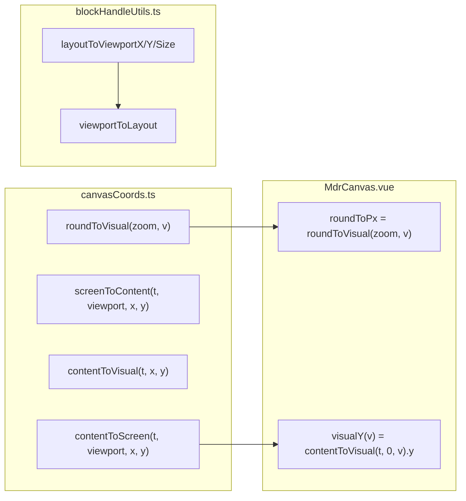

<!-- 最后验证: 2026-10-4 -->
# 01 坐标系

## 三句话

1. **screen 与 viewport 是同一个东西**（clientX/Y），只是两个文件起了不同名字。
2. **content 与 layout 不是同一个东西**，但都绑定同一块 DOM；它们之间没有直接公式，只有"把块当锚点"对齐。
3. **getCanvasScale 里的 domScale 是实测修正**，不是推导，接受它是经验值。

## 图 1.1 双坐标系总图

## 图 1.2 getCanvasScale 系数推导

**说明**：`domScale` 是为兼容"BCR 是否含 zoom"的浏览器差异而实测的，不是公式推导。

## 图 1.3 坐标系换算函数索引

## 验收标准

你能指着图说出以下函数在哪条边上：

- `contentToScreen` / `screenToContent`
- `roundToPx` / `roundToVisual` / `visualY`
- `layoutToViewportX/Y/Size` / `viewportToLayout`

说不出，说明还没读懂。

## 维护提示

- 新增坐标系 → 更新图 1.1
- 新增换算函数 → 更新图 1.3
- 改 getCanvasScale → 检查 11-workarounds.md