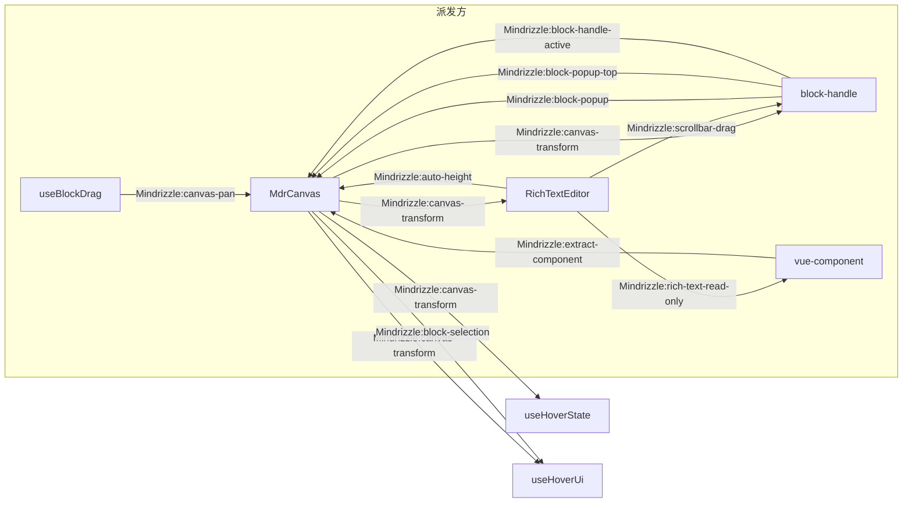
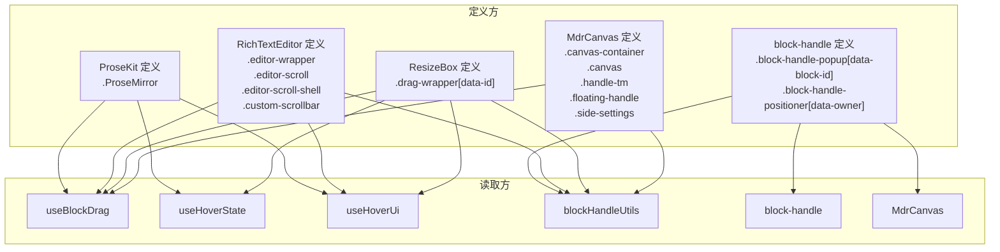

<!-- 最后验证: 2026-10-4 -->
# 02 跨组件契约

> 这个系统真正的接口不是函数签名，而是**事件名和 DOM 选择器**。改任何名字前先查这两张表。

## 图 2.1 CustomEvent 契约

### 事件明细

| 事件名 | 派发方 | 监听方 | 目的 |
|---|---|---|---|
| `Mindrizzle:canvas-transform` | MdrCanvas | RichTextEditor / block-handle / useHoverState / useHoverUi | pan/zoom 变化 |
| `Mindrizzle:block-selection` | MdrCanvas | useHoverUi | 块选中变化 |
| `Mindrizzle:block-popup` | block-handle | MdrCanvas | popup 遮挡 tm 手柄 |
| `Mindrizzle:block-popup-top` | block-handle | MdrCanvas | popup 上方开启 |
| `Mindrizzle:block-handle-active` | block-handle | MdrCanvas | popup 激活 |
| `Mindrizzle:auto-height` | RichTextEditor | MdrCanvas | 上报内容高度 + 光标 y |
| `Mindrizzle:canvas-pan` | useBlockDrag | MdrCanvas | 拖拽贴边驱动画布平移 |
| `Mindrizzle:extract-component` | vue-component | MdrCanvas | 插入组件拖出成块 |
| `Mindrizzle:rich-text-read-only` | RichTextEditor | vue-component | 只读态同步 |
| `Mindrizzle:scrollbar-drag` | RichTextEditor | block-handle | 滚动条拖拽时收 popup |

## 图 2.2 DOM 选择器契约

### 选择器明细

| 选择器 | 定义处 | 读取方 |
|---|---|---|
| `.canvas-container` | MdrCanvas | useBlockDrag / blockHandleUtils / useHoverState |
| `.canvas` | MdrCanvas | block-handle（Teleport 目标） / blockHandleUtils |
| `.drag-wrapper[data-id]` | ResizeBox | 几乎全部 |
| `.editor-wrapper` | RichTextEditor | useBlockDrag / useHoverUi |
| `.editor-scroll` | RichTextEditor | blockHandleUtils / useHoverUi |
| `.ProseMirror` | ProseKit | 所有 hook |
| `.block-handle-popup[data-block-id]` | block-handle | block-handle / useBlockDrag |
| `.block-handle-positioner[data-owner]` | block-handle | blockHandleUtils |
| `.handle-tm` / `.floating-handle` / `.side-settings` | MdrCanvas | useHoverState / useHoverUi |
| `.custom-scrollbar` / `.editor-scroll-shell` | RichTextEditor | block-handle |

## 维护提示

- **改任何事件名或选择器名 → 先查这两张表**，再 grep 确认
- 新增事件 / 选择器 → 同步更新图与表