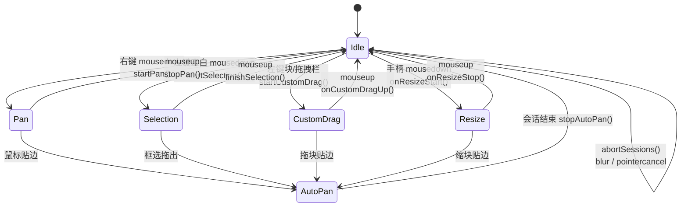
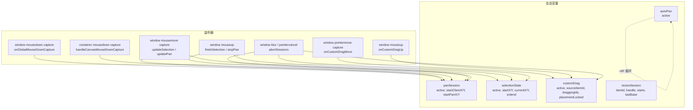
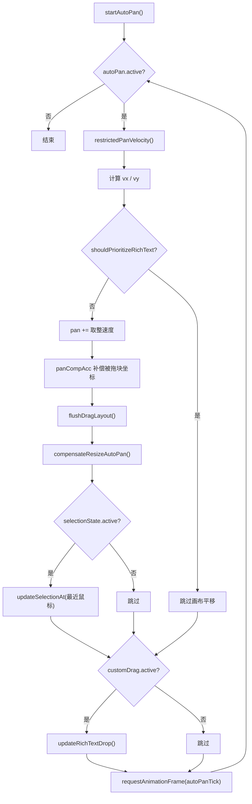

<!-- 最后验证: 2026-10-4 -->
# 03 交互会话状态机（MdrCanvas 内部）

> 这个文件里有 5 个会话变量互相抢鼠标，是 bug 高发区。

## 五个会话

| 会话 | 变量 | 启动 | 结束 |
|---|---|---|---|
| 手动平移 | `panSession` | 右键 mousedown | mouseup → stopPan |
| 框选 | `selectionState` | 左键空白 mousedown | mouseup → finishSelection |
| 拖块 | `customDrag` | 左键块/拖拽栏 | mouseup → onCustomDragUp |
| 缩放 | `resizeSession` | 手柄 mousedown | mouseup → onResizeStop |
| 自动平移 | `autoPan` | 任何会话贴边 | 会话结束 → stopAutoPan |

## 图 3.1 五大交互会话总状态机

## 图 3.2 会话变量与监听器位置

## 图 3.3 自动平移 autoPanTick 循环

## abortSessions

`window` 的 `blur` / `pointercancel` 会触发 `abortSessions()`，统一重置：

- `customDrag.active` → `onCustomDragUp()`
- `selectionState.active` → `finishSelection()`
- `panSession.active` → `stopPan()`
- `leftButtonDown = false`

**mouseup 丢失会让会话残留、守卫永久禁用**，所以这个函数很关键。

## 维护提示

- 新增会话 → 更新图 3.1、3.2，并加进 abortSessions
- 改监听器位置 → 更新图 3.2
- 改自动平移逻辑 → 更新图 3.3，并检查 04-drag-resize.md