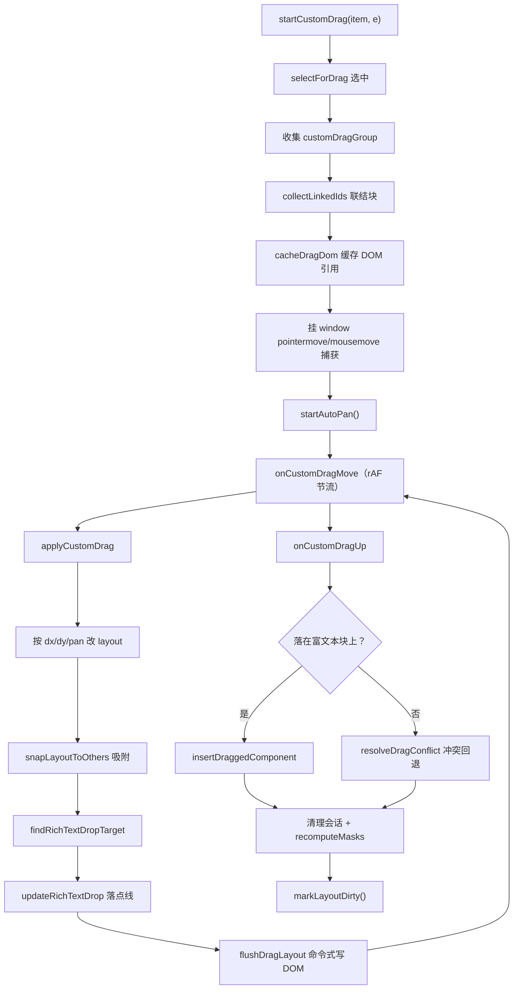
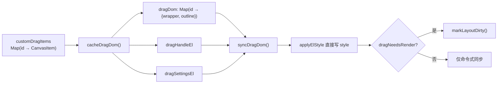
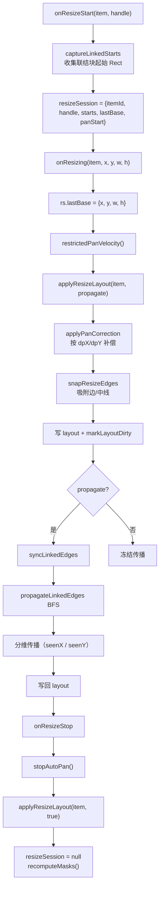
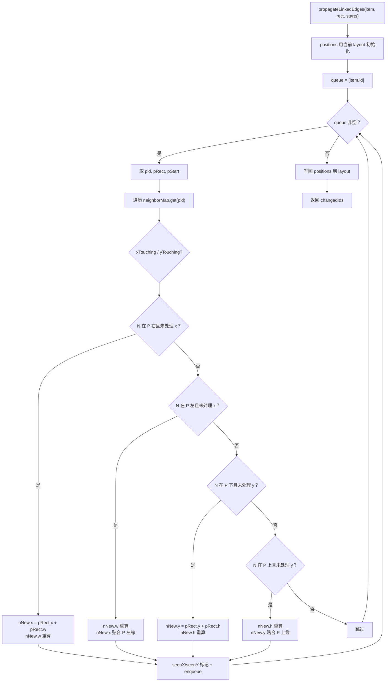
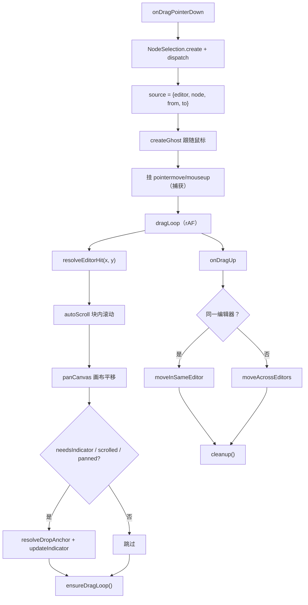

<!-- 最后验证: 2026-10-4 -->
# 04 拖拽与缩放

## 图 4.1 拖拽主流程

## 图 4.2 命令式 DOM 同步路径

> 拖拽期间 layout 不触发渲染，块本体与跟随浮层靠命令式写 DOM。只有存在链接时 `dragNeedsRender = true` 退回逐帧重渲染。

## 图 4.3 Resize 与联结传播

## 图 4.4 propagateLinkedEdges 分维 BFS

> 分维 BFS 的关键：`seenX` / `seenY` 独立标记，避免交叉轴被反复拉走。

## 图 4.5 useBlockDrag 行拖拽

> 这是编辑器内的行级拖拽，与画布级块拖拽（4.1）完全不同。**Tauri Linux 的 WebKitGTK 不派发 HTML5 DnD**，所以用 pointerdown + window 级事件自实现。

## 维护提示

- 改拖拽吸附逻辑 → 更新图 4.1，并补充相关回归验证
- 改 propagateLinkedEdges → 更新图 4.4 + 加特征测试
- 改命令式同步 → 更新图 4.2