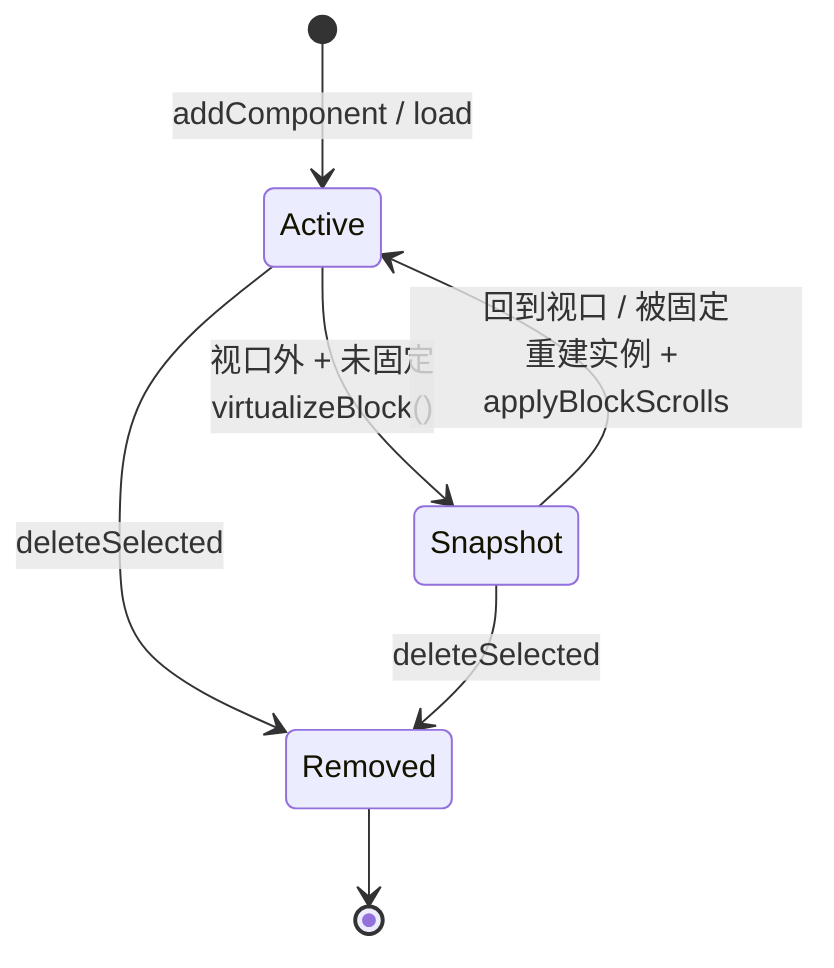
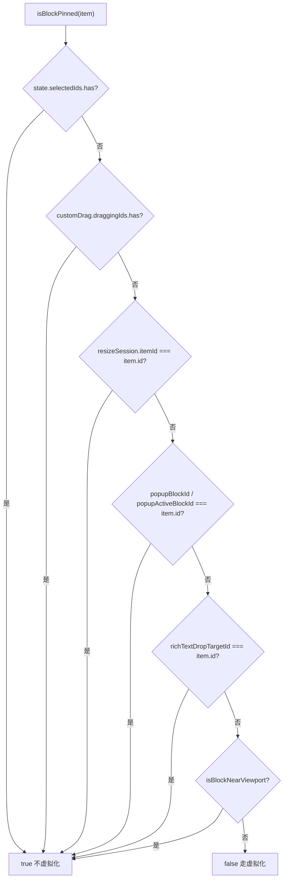
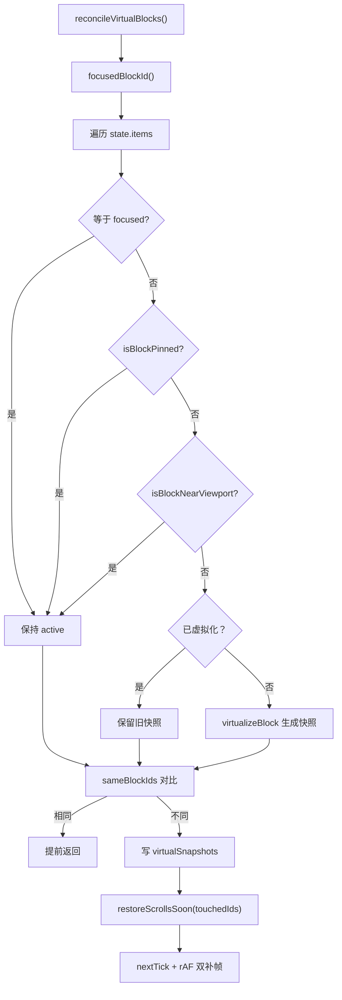
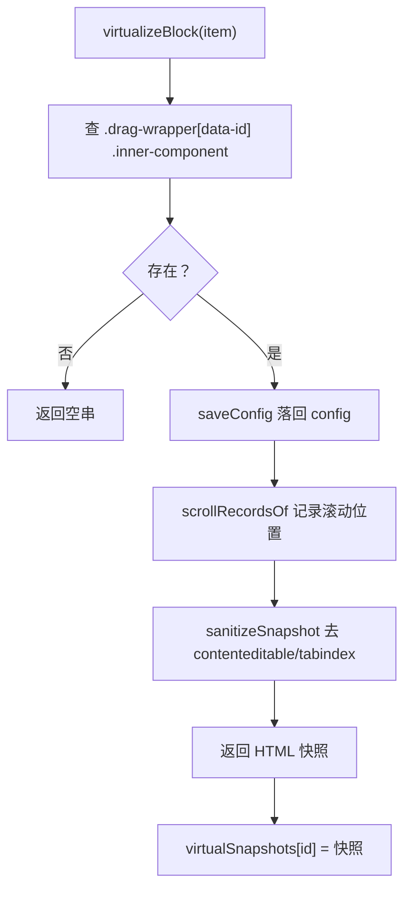
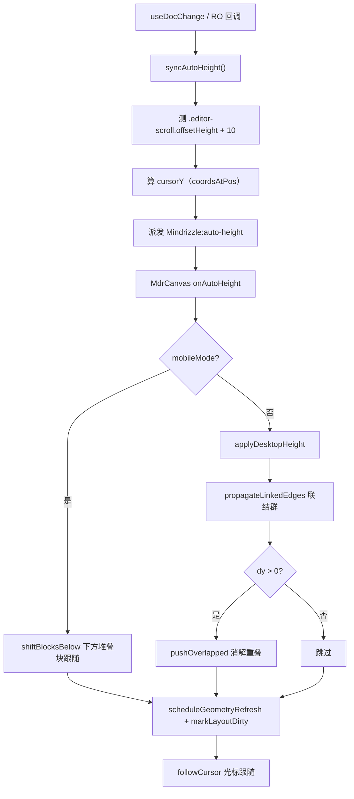

<!-- 最后验证: 2026-10-4 -->
# 05 块生命周期

## 三种状态

- **Active**：真实组件实例挂载，ProseMirror 完整运行
- **Snapshot**：视口外，实例销毁，只留 sanitized DOM 快照
- **Removed**：已删除

## 图 5.1 块虚拟化状态机

## 图 5.2 isBlockPinned 判定

> 以下情况永不虚拟化：选中 / 拖拽中 / resize 中 / popup 打开 / 富文本落点目标。

## 图 5.3 reconcileVirtualBlocks 主流程

## 图 5.4 virtualizeBlock 内部

> 顺序很重要：**先 saveConfig → 再记录滚动 → 最后克隆 HTML**。实例一去，doc 与 DOM 都取不到。

## 图 5.5 autoHeight 高度上报与推挤

## 维护提示

- 新增"固定块"条件 → 更新图 5.2
- 改虚拟化顺序 → 更新图 5.4
- 改 autoHeight 推挤 → 更新图 5.5，并补充相关回归验证