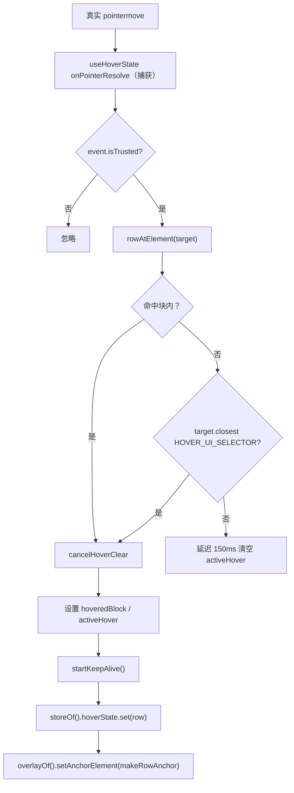
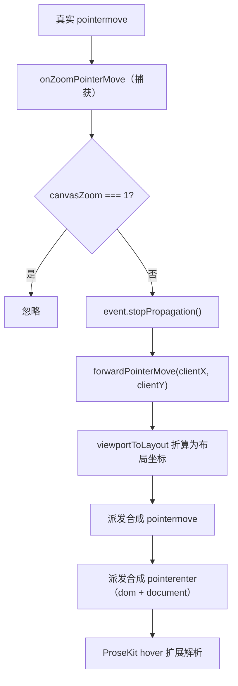
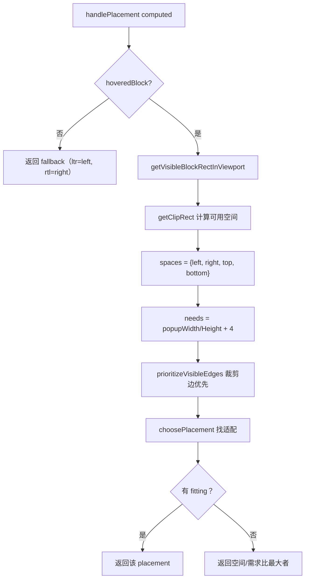
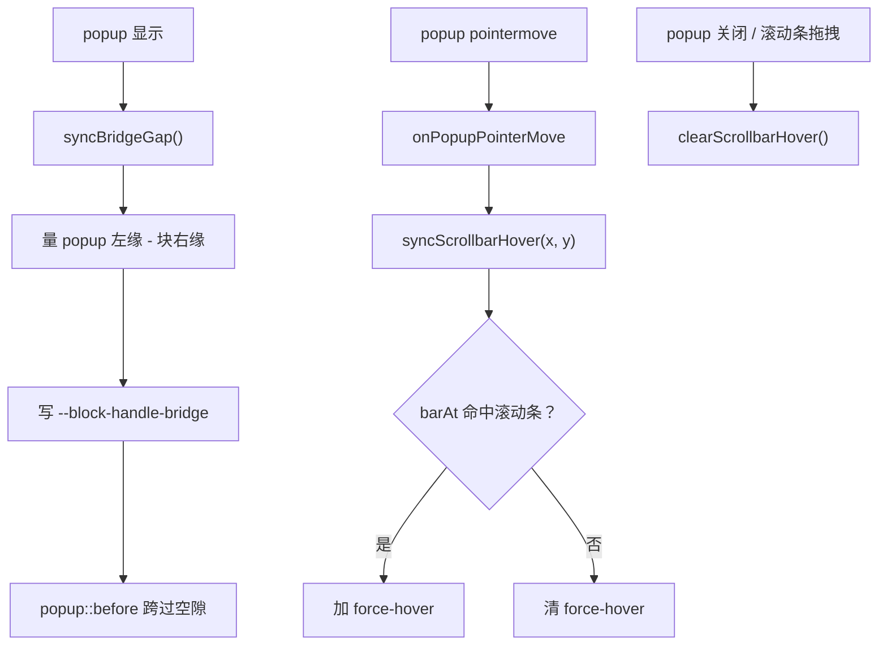
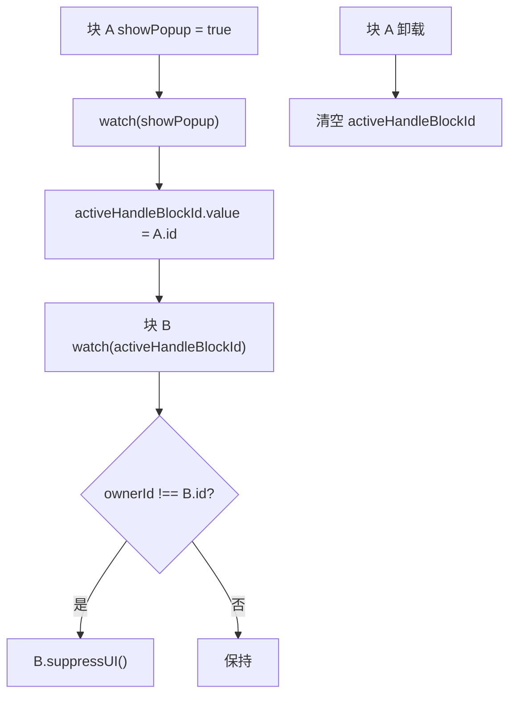
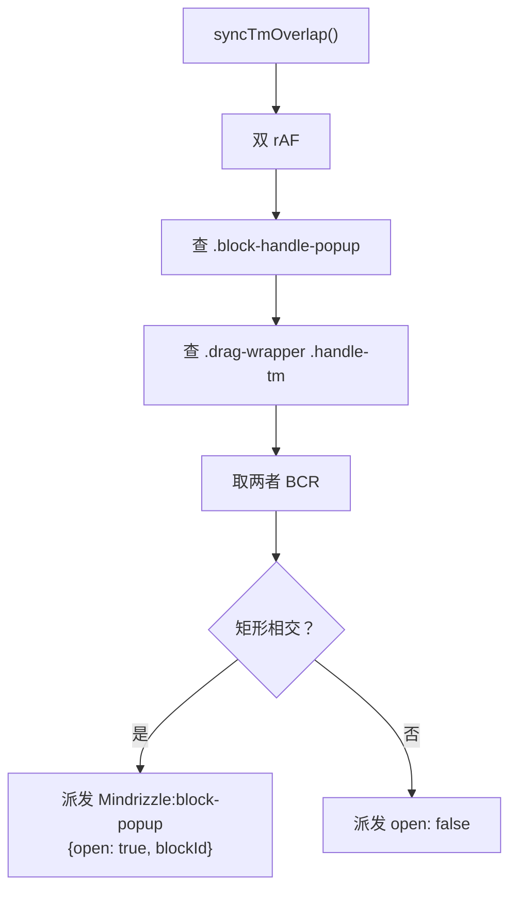

<!-- 最后验证: 2026-10-4 -->
# 06 悬浮手柄与 popup

## 图 6.1 hover 状态解析流程

## 图 6.2 zoom≠1 时的 pointermove 转发

> ProseKit 只认布局坐标、真实指针是视口坐标，所以 zoom≠1 时拦下真实事件、改喂换算后的合成 pointermove。

## 图 6.3 popup 定位选择 handlePlacement

## 图 6.4 popup 桥接与滚动条 hover

## 图 6.5 activeHandleBlockId 仲裁

> 多选时 keepAlive 会让已激活 popup 残留、互相"折叠"，用模块级 `activeHandleBlockId` 仲裁。

## 图 6.6 popup 遮挡 tm 手柄检测

## 维护提示

- 改 popup 放置策略 → 更新图 6.3
- 改桥接区 → 更新图 6.4 + 检查 11-workarounds.md
- 改 owner 仲裁 → 更新图 6.5