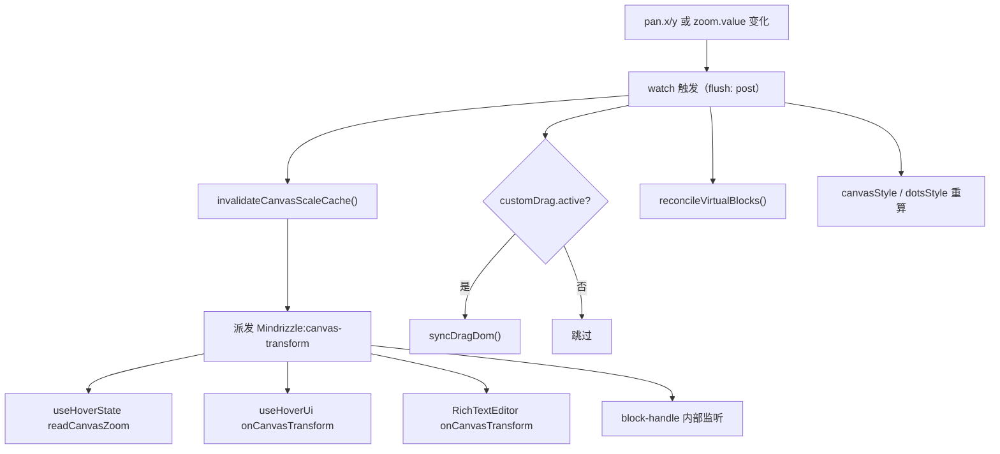
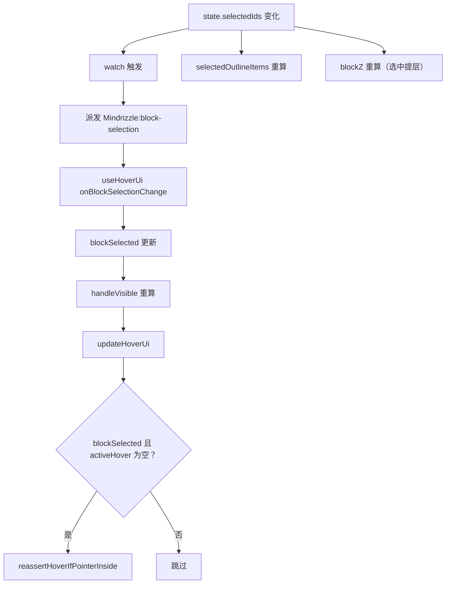
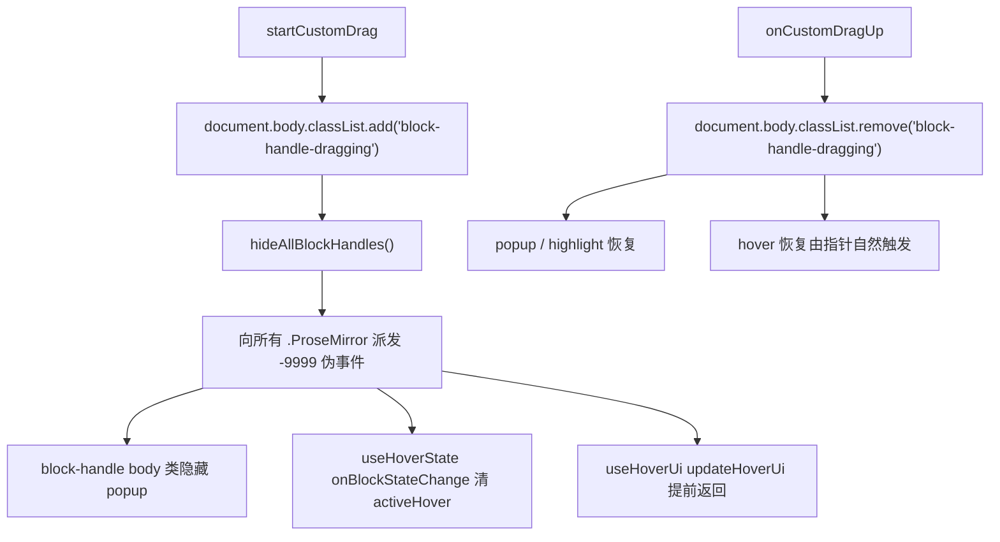

<!-- 最后验证: 2026-10-4 -->
# 07 事件连锁反应

> 事件契约见 02-contracts.md，本文件回答"派发之后发生了什么"。

## 图 7.1 pan / zoom 变化的连锁反应

## 图 7.2 块选中变化的连锁反应

## 图 7.3 拖拽开始/结束的全局信号

> `document.body.classList.contains('block-handle-dragging')` 是跨编辑器抑制 UI 的**全局 lock**。

## 维护提示

- 新增事件 → 更新 02-contracts + 本文件对应图
- 改事件监听顺序 → 更新图