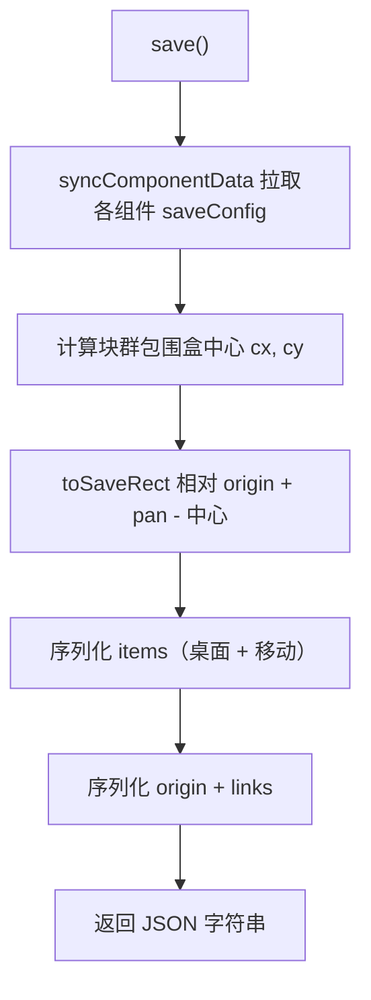
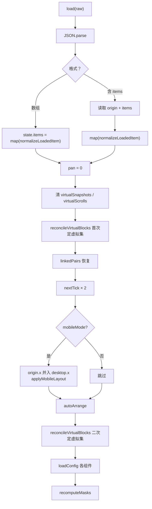
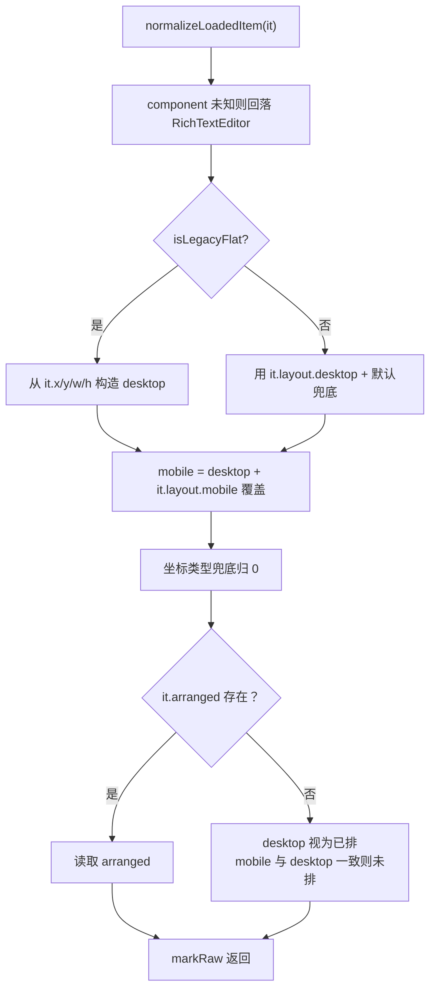

<!-- 最后验证: 2026-10-4 -->
# 08 序列化与兼容

## 图 8.1 save 数据流

## 图 8.2 load 数据流

## 图 8.3 normalizeLoadedItem 兼容分支

## 兼容规则速查

- 旧扁平格式（`it.x/y/w/h`）→ 转为 `layout.desktop`
- `origin` 坐标归一化：保存时减去块群中心，加载时归零 pan
- 移动端宽度运行时拉伸，不持久化
- `arranged` 缺失时：desktop 视为已排，mobile 若与 desktop 一致则视为未排

## 维护提示

- 新增字段 → 更新图 8.1、8.3
- 改兼容规则 → 更新图 8.3 + 加测试