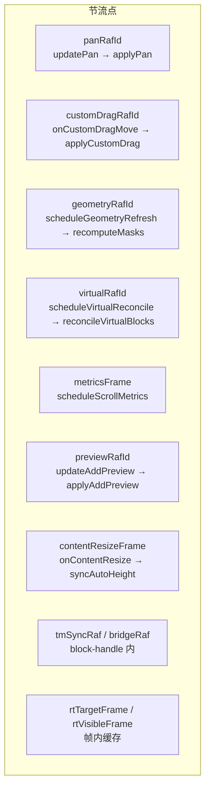
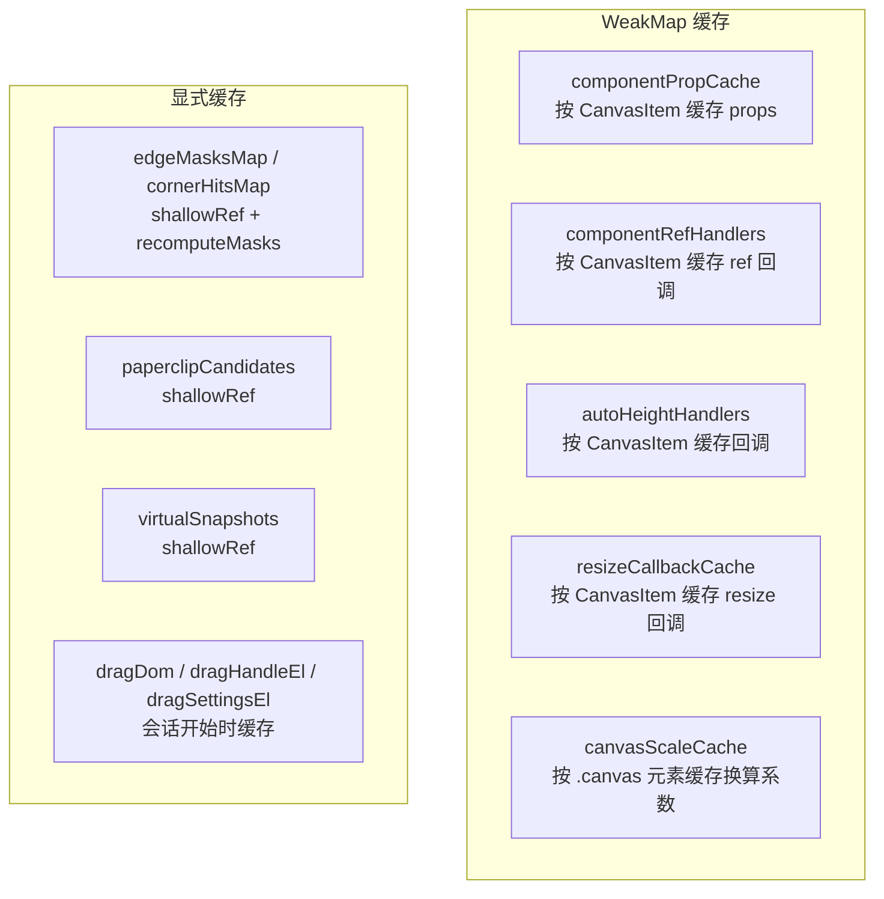
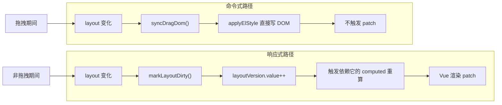

<!-- 最后验证: 2026-10-4 -->
# 09 性能：节流与缓存

## 图 9.1 rAF 节流点汇总

## 图 9.2 缓存表汇总

## 图 9.3 命令式 vs 响应式渲染路径

## 性能三原则

1. **逐帧路径不读 DOM**：用公式换算而不是 getBoundingClientRect
2. **高频路径合并到每帧一次**：rAF 节流
3. **回调与 props 按块缓存**：WeakMap，避免子组件重渲染

## 维护提示

- 新增逐帧路径 → 检查是否走 rAF + 是否读 DOM
- 新增缓存 → 更新图 9.2，并说明失效条件