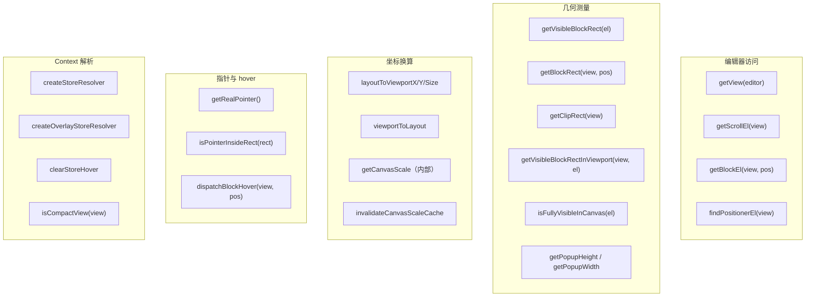
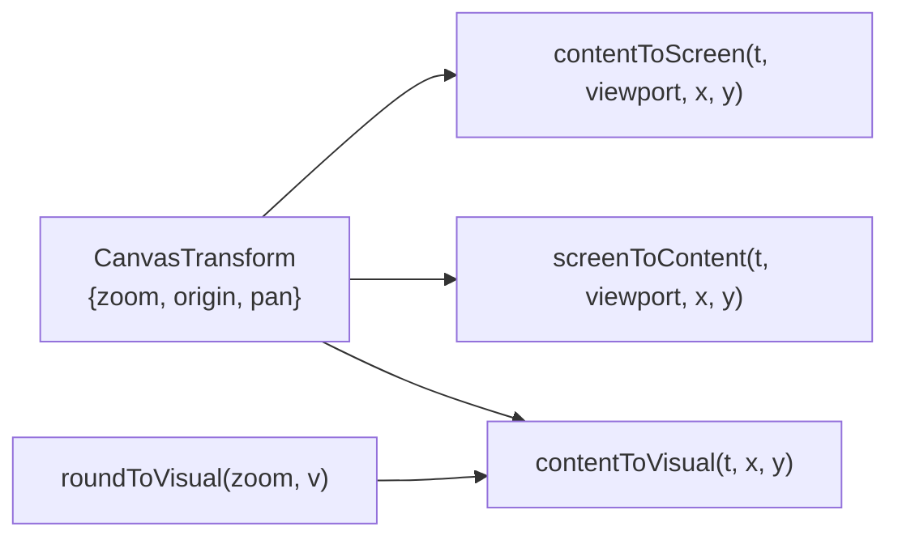

<!-- 最后验证: 2026-10-4 -->
# 10 工具函数索引

## 图 10.1 blockHandleUtils 函数分类

## 图 10.2 canvasCoords 函数

## 使用原则

- **编辑器内代码**：只用 `blockHandleUtils`，不要直接读 BCR 做换算
- **画布内代码**：只用 `canvasCoords`，不要自己拼公式
- **跨边界**：clientX/Y 是唯一共同的坐标空间

## 维护提示

- 新增换算函数 → 更新图 10.1 或 10.2
- 函数归类变化 → 更新对应图