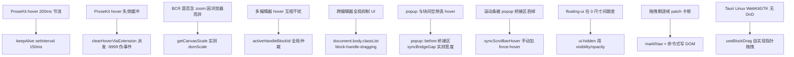
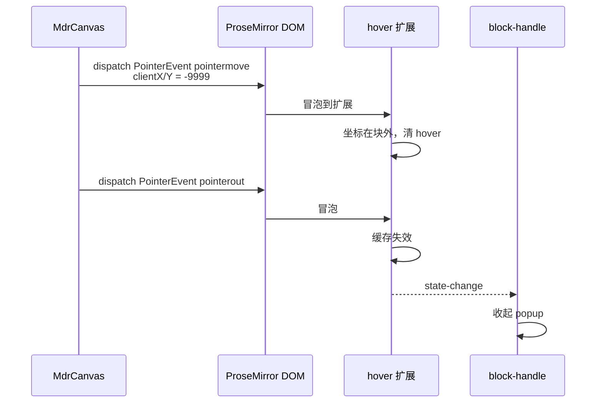

<!-- 最后验证: 2026-10-4 -->
# 11 Workarounds

> 这些地方代码看不懂很正常——**它们不是逻辑，是 workaround**。给它们贴标签，比读懂它们更值。

## 图 11.1 Workaround 索引

## 图 11.2 -9999 伪事件机制

## 判断原则

看到下面这些特征，先想"它在防御什么"，而不是"它为什么这么写"：

- `setInterval(..., 150)`：对抗 ProseKit 的 200ms 节流
- `clientX: -9999`：强制清 hover
- `document.body.classList`：跨组件全局 lock
- 实测比值代替公式：兼容浏览器差异
- `!important` 大量出现：覆盖第三方库内联样式

## 维护提示

- 第三方库升级 → 重新验证这些 workaround 是否还需要
- 新增 workaround → 更新图 11.1，并写清"防御什么"